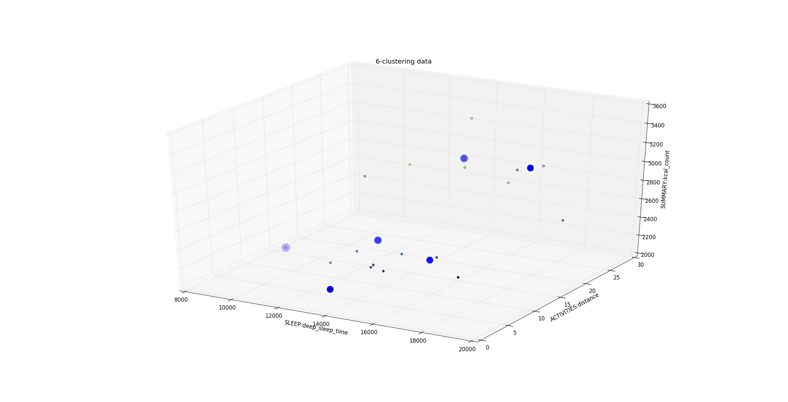
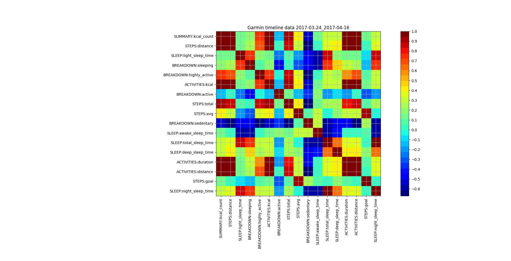
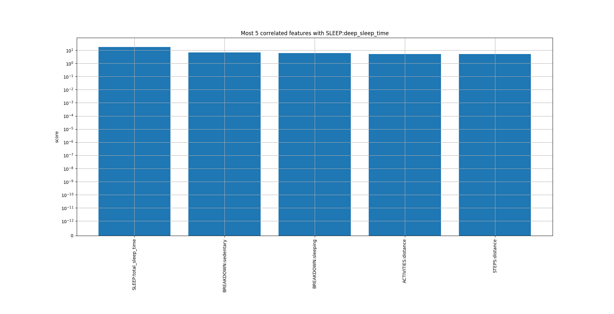

<div align="center">
<h1>PyGCE | Export, save, and analyze your Garmin Connect data</h1>
<em>There is a <a href="https://sirfoga.github.io/2017/04/16/pygce" rel="nofollow">detailed blog post</a> explaining all this fuss in a nice and easy way. Please, take a look.</em></br></br>
</div>


<div align="center"><a href="https://landscape.io/github/sirfoga/pygce/master"></a> <a href="https://www.python.org/download/releases/3.6.0/"></a></div>

<div align="center">
<a href="https://opensource.org/licenses/MIT"></a> <a href="https://opensource.org/licenses/MIT"></a>
<a href="https://github.com/sirfoga/pygce/issues"></a> <a href="http://unlicense.org/"></a>
</div>


## Install

Different ways, all equals
- ```$ pip3 install . --upgrade --force-reinstall``` from the source
- ```$ pip3 install pygce``` via [pip](https://pypi.org/project/pygce/)
- ```$ bash install.sh ```
- ```$ bash fast_install.sh ``` use this only if you are sure you met all dependencies

Just run `python3 setup.py install --force` to upgrade from local
installation


## Usage
A simple `pygce -h` from the terminal should result in this output
```
usage: -u <username (email) to login to Garmin Connect> -p <password to login to Garmin Connect> -c <path to chromedriver to use> -d <days to save. e.g -d 2017-12-30 or -d 2016-01-01 2017-12-30> -f <format of output file [json, csv]> -o <path to output file>

optional arguments:
  -h, --help            show this help message and exit
  -user                 username (email) to login to Garmin Connect
  -password             password to login to Garmin Connect
  -url URL              url to connect to (e.g https://connect.garmin.com)
  -chrome               path to chromedriver to use
  -d [DAYS [DAYS ...]]  days to save. e.g -d 2017-12-30 or -d 2016-01-01 2017-12-30
  -f                    format of output file [json, csv]
  -gpx                  download .gpx files too [y/n]
  -out                  path to output file
```
When called with appropriate args `pygce` saves `.csv` or `.json` data dumps of your Garmin Connect timeline data. The files will look like
```
{
  "2017-04-09": {
    "steps": {
      "avg": "12948.0",
      "goal": "11197.0",
      "distance": "19.7",
      "total": "16902.0"
    },
    "sleep": {
      "total_sleep_time": "00:08:23",
      "light_sleep_time": "00:03:16",
      "awake_sleep_time": "00:00:19",
      "deep_sleep_time": "00:04:48",
      "wake_time": "07:34:00",
      "bed_time": "23:11:00",
      "nap_time": "00:00:00",
      "night_sleep_time": "00:08:23"
    },
    "activities": [
```
You can browse a [`full json output`](sample.json) for a single day.
If you instead chose the `csv` output format you should see something like this:
```
SUMMARY:comment,SLEEP:deep_sleep_time,ACTIVITIES:distance,STEPS:goal,STEPS:distance,BREAKDOWN:sleeping,SUMMARY:likes,SLEEP:bed_time,STEPS:avg,SLEEP:light_sleep_time
sweet dinner,00:04:55,22.82,10000,22.8,29,6,22:22:00,12087,00:03:36
met girlfriend in river park,00:02:47,8.92,10200,8.9,22,9,01:05:00,11940,00:01:42
droven all around ny,00:03:41,3.38,10272,3.4,27,2,03:01:00,10045,00:02:33
```
Browse a [`sample csv output`](sample.csv) for 3 days.


## Sample analysis output
As of now, the [analysis](pygce/analysis/cli.py) has not been included in the main cli program, nor has a mature command line parser: you can play with it as you want!
There is lots of machine-learning stuff already done, and you can browse some samples [here](analysis_images). Mainly the focus is on clustering, best features selection and regression. Feel free to [contribute](https://github.com/sirfoga/pygce/pulls)!






## Documentation
- You can browse the [html](docs/doxygen/html/index.html)
- There is also the [pdf](docs/doxygen/latex/refman.pdf)


## Contributing
[Fork](https://github.com/sirfoga/pygce/fork) | Patch | Push | [Pull request](https://github.com/sirfoga/pygce/pulls)


## Feedback
Suggestions and improvements [welcome](https://github.com/sirfoga/pygce/issues)!


## Authors
| [](https://github.com/sirfoga "Follow @sirfoga on Github") |
|---|
| [Stefano Fogarollo](https://sirfoga.github.io) |


## License
[MIT License](https://opensource.org/licenses/MIT)
